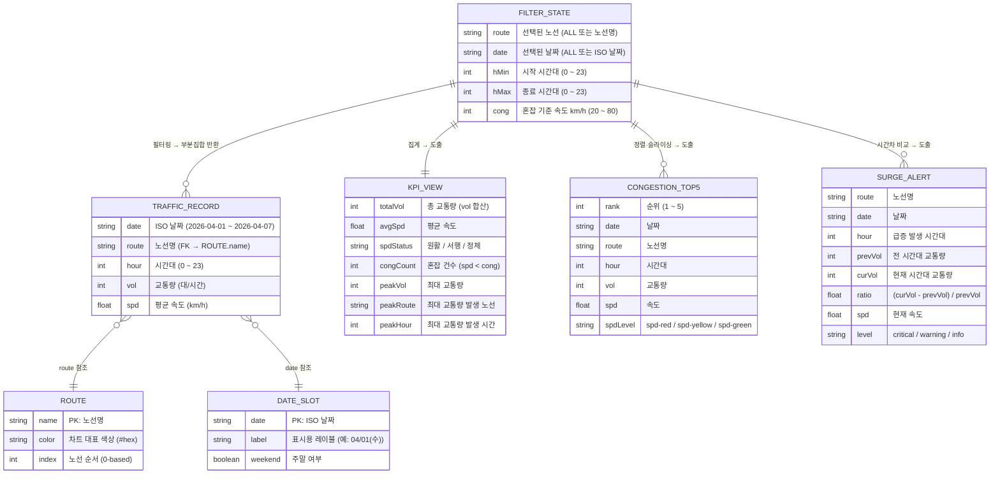

# ERD — 한국도로공사 교통량 모니터링 대시보드

> **주의**: 이 프로젝트는 DB가 없는 단일 HTML 파일이다.  
> ERD는 JavaScript 내부에서 사용되는 **논리적 데이터 구조(엔티티·관계)**를 Mermaid 다이어그램으로 표현한다.  
> 최종 수정: 2026-05-11

---

## 1. 전체 엔티티 관계도



---

## 2. 엔티티 상세 설명

### 2-1. TRAFFIC_RECORD (원천 데이터)

**실제 위치**: `traffic_dashboard.html` 내 `const RAW = [...]` (line 180, 약 59KB)

- **복합 PK**: `(date, route, hour)` — 세 값의 조합이 유일
- 총 **840개** 레코드: 5노선 × 7일 × 24시간
- `vol`과 `spd`는 항상 양수 (0 이하 값 없음)

```js
// 예시 레코드
{ date: "2026-04-01", route: "경부고속도로", hour: 8, vol: 4250, spd: 52.3 }
```

---

### 2-2. ROUTE (참조 테이블 — 상수로 관리)

**실제 위치**: `const ROUTES = [...]`, `const RCLR = [...]`

| index | name | color |
|---|---|---|
| 0 | 경부고속도로 | `#3b82f6` |
| 1 | 남해고속도로 | `#22c55e` |
| 2 | 서해안고속도로 | `#f59e0b` |
| 3 | 영동고속도로 | `#ec4899` |
| 4 | 중부고속도로 | `#a78bfa` |

---

### 2-3. DATE_SLOT (참조 테이블 — 상수로 관리)

**실제 위치**: `const DAYS = [...]`, `const DLBL = [...]`

| date | label | weekend |
|---|---|---|
| 2026-04-01 | 04/01(수) | false |
| 2026-04-02 | 04/02(목) | false |
| 2026-04-03 | 04/03(금) | false |
| 2026-04-04 | 04/04(토) | **true** |
| 2026-04-05 | 04/05(일) | **true** |
| 2026-04-06 | 04/06(월) | false |
| 2026-04-07 | 04/07(화) | false |

---

### 2-4. FILTER_STATE (런타임 상태)

**실제 위치**: `let st = { route, date, hMin, hMax, cong }`

- 브라우저 메모리에만 존재 (영속성 없음)
- 필터 UI 조작 시 즉시 갱신 → `render()` 트리거

| 필드 | 기본값 | 유효 범위 |
|---|---|---|
| `route` | `'ALL'` | `'ALL'` 또는 5개 노선명 중 하나 |
| `date` | `'ALL'` | `'ALL'` 또는 7개 ISO 날짜 중 하나 |
| `hMin` | `0` | `0 ≤ hMin ≤ hMax` |
| `hMax` | `23` | `hMin ≤ hMax ≤ 23` |
| `cong` | `60` | `20 ~ 80` (step: 5) |

---

### 2-5. KPI_VIEW (집계 뷰 — 렌더링 시 계산)

FILTER_STATE가 적용된 TRAFFIC_RECORD 부분집합에서 즉석 계산된 값이다.

```
totalVol  = SUM(vol)              -- 전체 합산
avgSpd    = AVG(spd)              -- 전체 평균
congCount = COUNT(spd < st.cong)  -- 혼잡 기준 미만 레코드 수
peakVol   = MAX(vol)              -- 단일 레코드 최대 교통량
```

---

### 2-6. CONGESTION_TOP5 (정렬 뷰)

```
ORDER BY spd ASC
LIMIT 5
```

`spdLevel` 결정 규칙:
- `spd < 40` → `"spd-red"`
- `40 ≤ spd < 60` → `"spd-yellow"`
- `spd ≥ 60` → `"spd-green"`

---

### 2-7. SURGE_ALERT (시간차 비교 뷰)

같은 `(route, date)` 그룹 내에서 `hour`와 `hour-1`을 비교한다.

```
ratio = (cur.vol - prv.vol) / prv.vol

level 결정:
  ratio ≥ 1.0                       → 'critical'
  0.5 ≤ ratio < 1.0                 → 'warning'
  cur.spd < st.cong AND cur.vol > 3000 → 'info'
```

- `prv.vol === 0`이면 계산 제외
- 결과를 `ratio DESC` 정렬 후 최대 5개 표시

---

## 3. 데이터 흐름 요약

```
[RAW 배열 840개]
        │
        ▼
  filtered()  ←── FILTER_STATE (st)
        │
        ├──► KPI 계산 → DOM 업데이트 (k1~k4)
        │
        ├──► 시간대별 집계 → cH (선형 차트) 업데이트
        │
        ├──► 날짜별 합산 → cD (막대 차트) 업데이트
        │
        ├──► 노선별 시간대 평균 → cR (막대 차트) 업데이트
        │
        ├──► spd 오름차순 TOP 5 → tTop5 (테이블) 업데이트
        │
        └──► 시간차 ratio 계산 → aList (경고 목록) 업데이트
```

---

## 4. 인덱스 / 조회 패턴

DB가 없으므로 JS 배열 `.filter()` / `.find()` / `.reduce()`로 매번 선형 탐색한다.  
성능 병목이 발생한다면 `(date, route, hour)` 복합키로 Map을 미리 구성하면 O(1) 조회 가능.

```js
// 현재 방식 (O(n) 매 렌더)
RAW.filter(r => r.route === rt && r.date === dt && r.hour === h)

// 개선 가능한 방식
const idx = new Map(RAW.map(r => [`${r.date}|${r.route}|${r.hour}`, r]))
idx.get(`${dt}|${rt}|${h}`)  // O(1)
```
